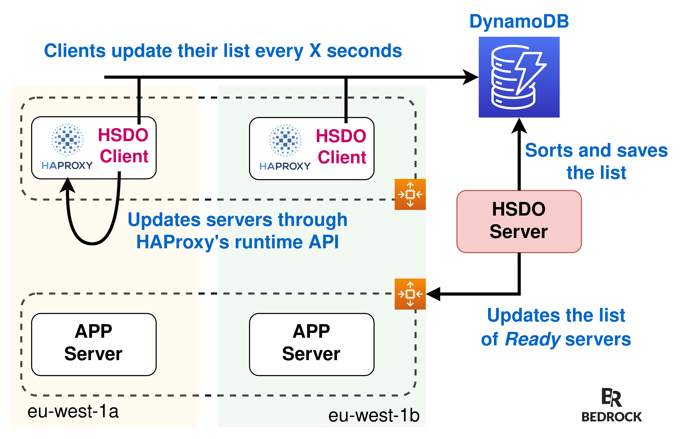
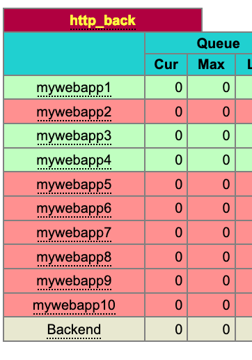

# haproxy-service-discovery-orchestrator
Orchestrate Service Discovery for HAProxy

We are currently using HSDO to load-balance our VOD traffic, between CDNs and our origins.
We have tested this platform with tens of HAProxy instances, reaching up to 200Gbps traffic.
We are using Spot instances to run HAProxy with HSDO, using multiple AZs, but by optimizing traffic through AZ (because inter-AZ traffic is extremely expensive).

- ASG or Consul is listing available servers
- HAProxy SDO Server gets servers from ASG, sort them, and save them in DynamoDB
- HAproxy SDO Clients get sorted servers from DynamoDB and send configuration to HAProxy Runtime API
- All HAProxy instances have the same configuration



## Why HSDO

AWS load balancers don't allow algorithms different from round robin.
HSDO allows to use HAProxy in front of one or multiple AutoScalingGroups on AWS.
HSDO implements ordered backend servers lists to use functionalities like consistent hashing, which makes it possible to use all the power of HAProxy, but on AWS.

By design, HSDO is able to run several HAProxy instances, to load balance from ten to hundreds of backend servers and separate traffic depending of AvailabilityZone.
It is reliable and fault tolerant, as each HAProxy server updates its configuration asynchronously from a DynamoDB table.

We wanted a very simple and efficient implementation for HSDO, which we didn't find in Consul.

## Prerequisities

This project is using pipenv. If you don't have it, please see [here](https://github.com/pypa/pipenv#installation).

You need to have `AWS_PROFILE`, `AWS_DEFAULT_REGION` setted and to be authenticated to access your DynamoDB table.

## Usage

In project directory:

```sh
pipenv install
pipenv shell
python3 src/main.py --[client|server] (--[debug]) (--[help])
```

## Configuration

Parameters can be defined through a config file or environment variables.
Environment variables will overwrite `conf/env.yaml`.


### Server Only

Configuration that is specific to HSDO Server.

`SERVER_ASG_NAMES`: List of ASG names where to find target servers (EC2 instances for which HAProxy will load balance traffic). May be a list, separated with comma. If `aws` mode enabled. Default to ` `.

`SERVER_CONSUL_API_URL`: Consul address where to find your target servers. If `consul` mode enabled. Default to ` `.

`SERVER_CONSUL_SERVICE_NAME`: Consul service name where to find your target servers. May be a list, separated with comma. If `consul` mode enabled. Default to ` `.

`SERVER_HAPROXY_BACKEND_SERVER_MIN_WEIGHT`: Default to `1`.

`SERVER_HAPROXY_BACKEND_SERVER_MAX_WEIGHT`: Default to `10`.

`SERVER_HAPROXY_BACKEND_SERVER_INCREASE_WEIGHT`: Default to `1`.

`SERVER_HAPROXY_BACKEND_SERVER_INCREASE_WEIGHT_INTERVAL`: In seconds, time between each weight increasing. For example, if we want to increase weight from 1 to 10 every 30 seconds, we need to wait for 5min. Default to `30`.

`SERVER_MODE`: Can be `aws` or `consul`. Default to ` `. `consul` is higly experimental, it probably doesn't work. Only `aws` mode is prod ready.

### Client Only

Configuration that is specific to each HSDO Client, next to HAProxy.

`CLIENT_HAPROXY_SOCKET_PATH`: HAProxy socket to use [Runtime API](https://cbonte.github.io/haproxy-dconv/2.0/management.html#9.3). Default to `/var/run/haproxy/admin.sock`.

`CLIENT_HAPROXY_BACKEND_NAME`: HAProxy default backend name. Default to ` `.

`CLIENT_HAPROXY_BACKEND_BASE_NAME`: HAProxy default backend base name for server template. Default to ` `.

`CLIENT_HAPROXY_BACKEND_SERVER_PORT`: Port of target servers. Default to `80`.

HAProxy default backend configuration can be seen in `haproxy.cfg`:
```
backend {{ CLIENT_HAPROXY_BACKEND_NAME }}
server-template  {{ CLIENT_HAPROXY_BACKEND_BASE_NAME }} 1-{{ HAPROXY_BACKEND_SERVERS_LIST_SIZE }} 127.0.0.2:{{ CLIENT_HAPROXY_BACKEND_SERVER_PORT }} check disabled
```

For example, with :
```
backend http-back
server-template mywebapp 1-10 127.0.0.2:80 check disabled
```
You will have this kind of statistique page : 



### Both

`INTERVAL`: Interval between each loop for client/server. Default to `1`.

`HAPROXY_BACKEND_SERVERS_LIST_SIZE`: As max range describe [here](https://cbonte.github.io/haproxy-dconv/2.0/configuration.html#4-server-template). Default to `10`.

`DEBUG`: To enable debug log. Default to `false`.

`DYNAMODB_TABLE_NAME`: Name of dynamodb table. Default to ` `.

`AWS_DEFAULT_REGION`: default region needed for dynamodb access. Default to ` `.

`EXPORTER_PORT`: port for prometheus exporter. Default to `6789`

## Dedicated ASG Configuration (AWS Only)

HSDO Client can be configured to follow specific ASGs that are present in `SERVER_ASG_NAMES`.
For example, if `SERVER_ASG_NAMES` contains `ASG1,ASG2,ASG3`, `CLIENT_ASG_NAMES` may follow `ASG2`. 
This is usefull if you want to split traffic per AZ for example.

This is possible if you enable `CLIENT_DEDICATED_ASG`.

If the target's ASG name is in `CLIENT_ASG_NAMES`, then the target is put in default HAProxy backend.
If the target's ASG name is not in `CLIENT_ASG_NAMES`, then the target is put in fallback HAProxy backend.
If needed, ASG name in `CLIENT_ASG_NAMES` can alse be added in fallback HAProxy backend with `CLIENT_ALL_SERVERS_IN_FALLBACK_BACKEND` enabled.

### Client only

`CLIENT_DEDICATED_ASG`: HSDO Client will use `CLIENT_ASG_NAMES` to configure HAProxy instead of reading all ASGs from HSDO Server. If server ASG in not present in `CLIENT_ASG_NAMES`, it will be set in the fallback backend define in `CLIENT_HAPROXY_FALLBACK_BACKEND_NAME`. Default to `false`.

`CLIENT_ASG_NAMES`: List of ASG that HSDO Client is using to configure HAProxy. May be a list, separated with comma. Needed with `CLIENT_DEDICATED_ASG`. Default to ` `.

`CLIENT_HAPROXY_FALLBACK_BACKEND_NAME`: HAProxy fallback backend name. Needed with `CLIENT_DEDICATED_ASG`. Default to ` `.

`CLIENT_HAPROXY_FALLBACK_BACKEND_BASE_NAME`: HAProxy fallback backend base name for server template. Needed with `CLIENT_DEDICATED_ASG`. Default to ` `.

`CLIENT_ALL_SERVERS_IN_FALLBACK_BACKEND`: to put also all default backend servers in the fallback backend. Default to `false`.

## DynamoDB

What dynamodb table should look like :

```
resource "aws_dynamodb_table" "service_discovery_orchestrator_table" {
  name           = "${var.project}-service-discovery-orchestrator"
  billing_mode   = "PROVISIONED"
  read_capacity  = 20
  write_capacity = 20
  hash_key       = "BackendServerID"

  attribute {
    name = "BackendServerID"
    type = "N"
  }

  tags = {
    Name         = "${var.project}-service-discovery-orchestrator"
    name         = "${var.project}-service-discovery-orchestrator"
    project      = var.project
    team         = var.team
    product_line = var.product_line
    tenant       = var.tenant
    customer     = var.customer
  }
}
```

## Tests

From root directory

```sh
pipenv shell
python3 -m unittest
```
